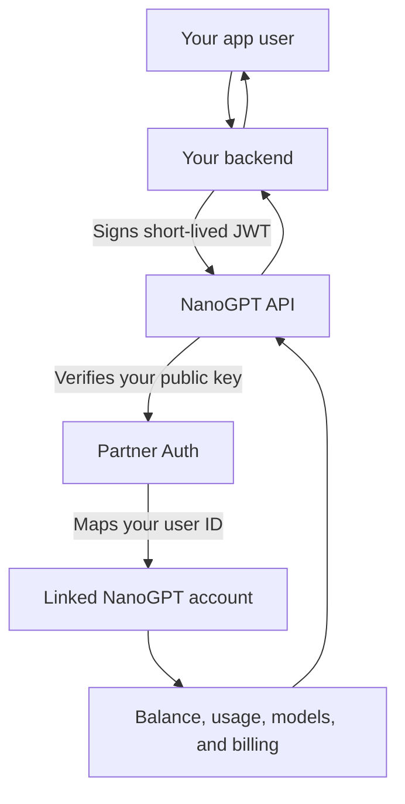

## Overview

Partner Auth lets your backend authenticate one of your users to NanoGPT without giving you direct access to NanoGPT account credentials or API keys.

You send a short-lived JWT signed by your backend. NanoGPT verifies it, maps your user ID to a normal NanoGPT account behind the scenes, and runs requests against that linked account.

The same partner user always maps to the same NanoGPT account.

<Note>
Partner Auth is available by request. Contact NanoGPT to configure your partner slug, JWT audience, public signing key, redirect allowlist, and optional commercial settings before production use.
</Note>

## How It Works



Your backend owns the private key. NanoGPT stores only the public key.

## What NanoGPT Configures

Before launch, NanoGPT configures:

- Your partner slug, for example `example`
- Your JWT audience, for example `nanogpt-partner-api:example`
- Your public signing key and key ID, for example `example-2026-04`
- Allowed browser redirect URLs for SSO
- Optional referral revenue share
- Optional partner tiers for discounts and request-access allowance rules

You keep the private key in your own secret manager.

## JWT Requirements

Every partner-authenticated request uses:

```http
Authorization: Bearer <partner-signed JWT>
```

JWT header:

```json
{
  "alg": "ES256",
  "kid": "example-2026-04"
}
```

JWT claims:

```json
{
  "iss": "example",
  "aud": "nanogpt-partner-api:example",
  "sub": "your-opaque-user-id",
  "iat": 1770000000,
  "exp": 1770000300,
  "jti": "unique-request-id",
  "scope": ["request:create"]
}
```

Rules:

- Use `ES256` or `RS256`.
- `exp - iat` must be at most 5 minutes.
- `jti` must be unique per request token.
- `sub` must be your stable user identifier, opaque to NanoGPT.
- Do not send emails, names, or other personal data as `sub`.
- NanoGPT stores `HMAC-SHA256(sub)`, not the raw `sub`.
- Create JWTs on your backend only. Never sign tokens in the browser.

Optional tier claim:

```json
{
  "tier": "premium"
}
```

NanoGPT validates the tier against your active partner tier configuration.

## Scopes

Use the smallest scope needed for each request.

| Scope | Purpose |
| --- | --- |
| `request:create` | Create AI requests such as chat, image, video, or audio requests |
| `session:web` | Create a one-time browser login link |
| `balance:read` | Read the linked user's NanoGPT balance |
| `deposit:create` | Create a deposit or top-up request |
| `usage:read` | Read usage for the JWT `sub` |
| `usage:read:any` | Backend-only scope to read usage for another `subject` query param |

## Send AI Requests

Use a partner JWT instead of a NanoGPT API key.

```bash
curl -X POST "https://nano-gpt.com/api/v1/chat/completions" \
  -H "Authorization: Bearer $PARTNER_JWT" \
  -H "Content-Type: application/json" \
  -d '{
    "model": "gpt-5.5",
    "messages": [
      { "role": "user", "content": "Summarize this article in three bullets." }
    ]
  }'
```

The JWT must include:

```text
request:create
```

The request is charged to the linked NanoGPT account for the JWT `sub`.

See also: [Chat Completion](/api-reference/endpoint/chat-completion), [Image Generation](/api-reference/image-generation), and [Video Generation](/api-reference/video-generation).

## Check User Balance

```bash
curl -X POST "https://nano-gpt.com/api/check-balance" \
  -H "Authorization: Bearer $PARTNER_JWT"
```

The JWT must include:

```text
balance:read
```

The response includes the linked user's balance and deposit details.

## Initiate A Top-Up

For native Nano deposits, read the linked user's `nanoDepositAddress` from the balance response and show that address to the user. See [Check User Balance](#check-user-balance).

For invoice-style payment methods, create a deposit for the linked user with the ticker route:

```bash
curl -X POST "https://nano-gpt.com/api/transaction/create/btc-ln" \
  -H "Authorization: Bearer $PARTNER_JWT" \
  -H "Content-Type: application/json" \
  -d '{"amount": 0.00001}'
```

The JWT must include:

```text
deposit:create
```

NanoGPT resolves the user from the JWT `sub` and returns deposit details for that linked account. For ticker-specific limits and supported payment methods, see [Crypto Deposits](/api-reference/endpoint/crypto-deposits).

## Browser SSO

Use browser SSO when you want to send a user from your product into NanoGPT already signed in as the linked account.

Create a one-time login link:

```bash
curl -X POST "https://nano-gpt.com/api/partners/auth/login-links" \
  -H "Authorization: Bearer $PARTNER_JWT" \
  -H "Content-Type: application/json" \
  -d '{
    "redirect_url": "https://your-product.example/account/ai"
  }'
```

The JWT must include:

```text
session:web
```

NanoGPT returns:

```json
{
  "url": "https://nano-gpt.com/auth/partner/example?token=...",
  "expiresAt": "2026-05-07T12:00:00.000Z"
}
```

The login token is one-time use and short-lived. Absolute redirect URLs must be allowlisted.

## Read User Usage

Read usage for the JWT `sub`:

```bash
curl "https://nano-gpt.com/api/partners/users/usage?duration=month" \
  -H "Authorization: Bearer $PARTNER_JWT"
```

The JWT must include:

```text
usage:read
```

Backend service usage lookup for a specific user:

```bash
curl "https://nano-gpt.com/api/partners/users/usage?subject=your-opaque-user-id&duration=month" \
  -H "Authorization: Bearer $PARTNER_SERVICE_JWT"
```

If `subject` differs from the JWT `sub`, the JWT must also include:

```text
usage:read:any
```

Use `usage:read:any` only from trusted backend services.

## Funding Options

NanoGPT supports user-funded usage by default:

- Each linked user has their own NanoGPT balance.
- Your product can show the user's balance and top-up options.
- If the linked user has no balance, paid requests return the normal insufficient-balance response.
- If configured, your partner account can earn referral revenue from user-funded top-ups.

Partner tiers can configure usage discounts once NanoGPT enables tiers for your integration:

- `free`: no discount
- `basic`: 5% discount
- `premium`: 10% discount

Tier names and discount rates are configurable per partner.

## Request-Access Funding Features

Some funding options require NanoGPT approval and explicit configuration before they can be used:

- Free starter prompts or free starter credits
- Partner-funded daily, weekly, monthly, or one-time allowances
- Custom per-tier discounts
- Partner settlement for sponsored usage

These options are not automatically available just because Partner Auth is enabled. Treat them as request-access features: describe the desired user plans, allowance amounts, discount rates, expected volume, and settlement model to NanoGPT before launch.

Allowance rules are modeled for partner-funded usage:

- one-time signup allowance
- weekly allowance
- monthly allowance

Allowance settlement is not an active production payment source unless NanoGPT explicitly enables it for your integration.

## Error Handling

Common responses:

| Status | Meaning |
| --- | --- |
| `401` | Missing, invalid, expired, replayed, or unauthorized partner JWT |
| `402` | Linked user needs balance before the request can run |
| `403` | JWT is valid but missing the required scope |
| `429` | Too many requests or too many auth failures |
| `500` | NanoGPT could not complete the server-side operation |

Retry only when the error is transient, such as `429` or `500`.

## Security Checklist

- Sign JWTs only on your backend.
- Keep private keys in your secret manager.
- Use short-lived JWTs, max 5 minutes.
- Use a unique `jti` per request token.
- Use opaque stable user IDs as `sub`.
- Never put PII in `sub`.
- Request only the scopes needed for the operation.
- Do not expose `usage:read:any` or `deposit:create` from browser code.
- Rotate keys periodically and revoke old keys after rollout.

## Minimal Backend Flow

1. User opens your AI feature.
2. Your backend signs a JWT with `sub = your user id` and the needed scope.
3. Your backend calls NanoGPT with `Authorization: Bearer <jwt>`.
4. NanoGPT verifies the JWT and maps the user to a linked NanoGPT account.
5. NanoGPT runs the request, checks balance, applies configured partner discount, and records usage.
6. Your product renders the result to the user.
