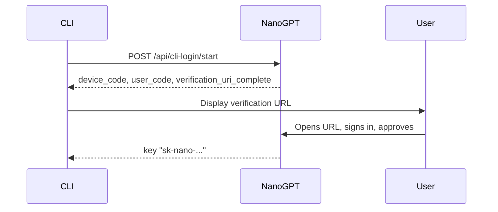

# NanoGPT CLI Device Login Integration Guide

This guide explains how to integrate device login into your CLI application so users can authenticate without embedding a browser.

## Overview

The NanoGPT CLI device login flow works like the GitHub CLI or Claude Code login:

1. Your CLI requests a login code from NanoGPT.
2. User opens a URL in their browser and signs in.
3. User approves the CLI access.
4. Your CLI receives an API key (`sk-nano-...`).



## Step 1: Start the login flow

Make a POST request to initiate login:

```bash
curl -X POST "https://nano-gpt.com/api/cli-login/start" \
  -H "Content-Type: application/json" \
  -d '{"client_name": "your-app-name"}'
```

### Request body

| Field | Type | Required | Description |
|-------|------|----------|-------------|
| `client_name` | string | No | Your application name (max 64 chars). Used to identify the API key in the user's account. |

### Response

```json
{
  "device_code": "0Reyai4sGnBE8em8lMLRxDhC-XtQMC2obf8hnVDUWws",
  "user_code": "VS8Q-ZY3Q",
  "verification_uri": "https://nano-gpt.com/cli-login/verify",
  "verification_uri_complete": "https://nano-gpt.com/cli-login/verify?code=VS8Q-ZY3Q",
  "expires_in": 600,
  "interval": 2
}
```

| Field | Description |
|-------|-------------|
| `device_code` | Secret token for polling. Keep this secure and do not display to the user. |
| `user_code` | Human-readable code displayed on the approval page. |
| `verification_uri` | Base URL for the user to visit. |
| `verification_uri_complete` | Full URL with the code pre-filled. Display this to the user. |
| `expires_in` | Seconds until the code expires (600 = 10 minutes). |
| `interval` | Recommended polling interval in seconds. |

## Step 2: Direct the user to approve

Display the `verification_uri_complete` URL to the user. They should open it in their browser.

Example output in your CLI:

```
To authenticate, open this URL in your browser:

  https://nano-gpt.com/cli-login/verify?code=VS8Q-ZY3Q

Waiting for approval...
```

When the user opens the URL:
1. They sign in with their NanoGPT account (Google, Discord, etc.).
2. They see the verification code and click "Approve".
3. They can close the browser and return to the CLI.

## Step 3: Poll for approval

Poll the status endpoint until you receive the API key:

```bash
curl -X POST "https://nano-gpt.com/api/cli-login/poll" \
  -H "Content-Type: application/json" \
  -d '{"device_code": "0Reyai4sGnBE8em8lMLRxDhC-XtQMC2obf8hnVDUWws"}'
```

### Response codes

| Status | Response | Action |
|--------|----------|--------|
| `202` | `{"status": "authorization_pending"}` | Continue polling |
| `200` | `{"status": "approved", "key": "sk-nano-..."}` | Success. Store the key |
| `410` | `{"status": "expired"}` | Code expired. Restart the flow |
| `409` | `{"status": "consumed"}` | Key already delivered. Check your storage |
| `404` | `{"error": "invalid_code"}` | Invalid `device_code` |

### Polling example (bash)

```bash
while true; do
  response=$(curl -sS -X POST "https://nano-gpt.com/api/cli-login/poll" \
    -H "Content-Type: application/json" \
    -d "{\"device_code\":\"$DEVICE_CODE\"}")

  echo "$response"

  if echo "$response" | grep -q '"status":"approved"'; then
    API_KEY=$(echo "$response" | jq -r '.key')
    echo "Success! API key: $API_KEY"
    break
  fi

  if echo "$response" | grep -q '"status":"expired"'; then
    echo "Code expired. Please restart."
    exit 1
  fi

  sleep 2
done
```

## Step 4: Use the API key

Once you have the API key, use it for all NanoGPT API requests.

List available models:

```bash
curl "https://nano-gpt.com/api/v1/models" \
  -H "Authorization: Bearer sk-nano-..."
```

Chat completions (OpenAI-compatible):

```bash
curl "https://nano-gpt.com/api/v1/chat/completions" \
  -H "Authorization: Bearer sk-nano-..." \
  -H "Content-Type: application/json" \
  -d '{
    "model": "openai/gpt-5.2",
    "messages": [{"role": "user", "content": "Hello from my CLI!"}],
    "stream": true
  }'
```

## Complete integration example

```python
import time
import requests

def nanogpt_login(client_name="my-cli-app"):
    """Authenticate with NanoGPT using device login flow."""
    start_response = requests.post(
        "https://nano-gpt.com/api/cli-login/start",
        json={"client_name": client_name}
    )
    start_data = start_response.json()

    device_code = start_data["device_code"]
    verification_url = start_data["verification_uri_complete"]
    interval = start_data["interval"]

    print("\nTo authenticate, open this URL in your browser:\n")
    print(f"  {verification_url}\n")
    print("Waiting for approval...")

    while True:
        poll_response = requests.post(
            "https://nano-gpt.com/api/cli-login/poll",
            json={"device_code": device_code}
        )

        if poll_response.status_code == 200:
            poll_data = poll_response.json()
            if poll_data.get("status") == "approved":
                print("\nAuthentication successful!")
                return poll_data["key"]

        elif poll_response.status_code == 410:
            raise Exception("Login expired. Please try again.")

        time.sleep(interval)

api_key = nanogpt_login("my-awesome-cli")
print(f"API Key: {api_key}")
```

## API key management

- API keys created through this flow are named `CLI (<client_name>)` in the user's account.
- Users can view and revoke keys at https://nano-gpt.com/api.
- If the same `client_name` is used multiple times, the existing key is reused.
- Keys do not expire unless manually revoked.

## Error handling

| Scenario | How to handle |
|----------|---------------|
| User does not approve in time | Codes expire after 10 minutes. Restart the flow. |
| Invalid `device_code` | Check you are using the exact code from `/start`. |
| 401 on API requests | Key may have been revoked. Re-authenticate. |
| Rate limited | `/start`: 10 req/min, `/poll`: 60 req/min per IP. Use the recommended interval. |

## Security best practices

1. Store the API key securely (OS keychain, encrypted config, or secure credential storage).
2. Never log or display the `device_code`.
3. Handle key revocation by prompting the user to re-authenticate on 401s.
4. Use HTTPS only (`https://nano-gpt.com`).

## Rate limits

| Endpoint | Limit |
|----------|-------|
| `POST /api/cli-login/start` | 10 requests per minute per IP |
| `POST /api/cli-login/poll` | 60 requests per minute per IP |

## Summary

| Endpoint | Method | Purpose |
|----------|--------|---------|
| `/api/cli-login/start` | POST | Start login, get `device_code` and verification URL |
| `/api/cli-login/poll` | POST | Poll for approval status and retrieve API key |
| `/cli-login/verify?code=...` | GET | Browser page where the user approves |
